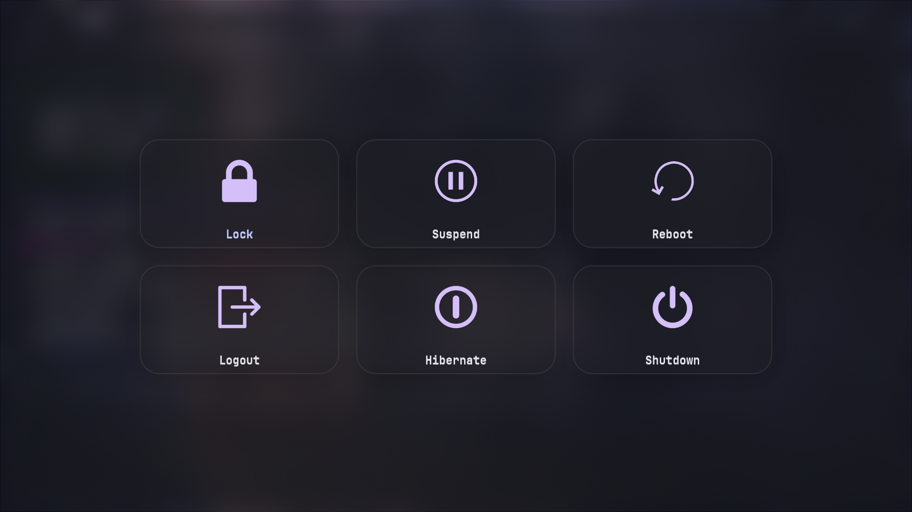

# ✨ wlogout: Matugen-Powered Aesthetic Edition

A highly aesthetic, modern, and interactive logout menu configuration for `wlogout`. This setup is designed to be fully dynamic, pulling its color palette directly from your wallpaper via [Matugen](https://github.com/InNoVayu/matugen).

---

## 📸 Preview



---

## 📸 Features

- **Matugen Integration:** Automatically stays in sync with your system theme by importing Material Design 3 color variables.
- **Modern Squircles:** Large, contemporary button shapes with 35px rounded corners.
- **Frosted Glass:** Semi-transparent backdrops and button surfaces for a premium "Glassmorphism" look.
- **Reactive UI:** - **Hover:** Buttons glow with your `@primary` color, scale the icon up, and show a soft outer glow. - **Active:** Clicking provides a "pressed" feedback with deeper color saturation and a slight scale-down.
- **Smooth Transitions:** Uses cubic-bezier curves for buttery smooth animations (200ms).
- **Iconic:** Mapped to standard system icons but styled to fit any color scheme.

---

## 🛠️ Prerequisites

To get the full experience, you should have the following installed:

1.  **[wlogout](https://github.com/ArtsySully/wlogout):** The logout menu itself.
2.  **[Matugen](https://github.com/InNoVayu/matugen):** For dynamic color generation.
3.  **Nerd Fonts:** The config defaults to `JetBrainsMono Nerd Font`.
4.  **Hyprland/systemctl:** Actions are configured for Hyprland (`hyprctl`) and systemd (`systemctl`).

---

## 🚀 Installation

1.  **Backup your current config:**

    ```bash
    mv ~/.config/wlogout ~/.config/wlogout.bak
    ```

2.  **Clone or Copy this directory:**
    Place the `layout`, `style.css`, and `colors.css` files into `~/.config/wlogout/`.

3.  **Matugen Setup:**
    Ensure your Matugen template generates a `colors.css` file in this directory or symlink it. This config expects variables like `@background`, `@primary`, `@surface_container`, etc.

---

## 📂 File Structure

- **`layout`**: Defines the buttons (Lock, Logout, Suspend, etc.), their keybinds, and the terminal commands they execute.
- **`style.css`**: The core Modern Squircles styling, animations, and Matugen color mapping.
- **`colors.css`**: The Matugen-generated stylesheet (automatically updated by your theme switcher).

---

## ⌨️ Default Keybinds

When `wlogout` is active, you can use these keys:

- **`L`**: Lock
- **`E`**: Logout (Exit Hyprland)
- **`U`**: Suspend
- **`H`**: Hibernate
- **`R`**: Reboot
- **`S`**: Shutdown

---

## 🎨 Customization

### Change Actions

Edit the `action` field in the `layout` file:

```json
{
  "label": "lock",
  "action": "swaylock", // Change hyprlock to swaylock if needed
  "text": "Lock",
  "keybind": "l"
}
```

### Adjust Transparency

Edit `style.css` and change the alpha values:

```css
window {
  background-color: alpha(@background, 0.6); /* 0.6 = 60% opacity */
}
```

---

## 🖥️ Usage

Run it with:

```bash
wlogout
```

_Note: Depending on your screen resolution, you might want to use the `-b` (buttons per row) flag. This config looks best with 3 or 6 buttons per row._
